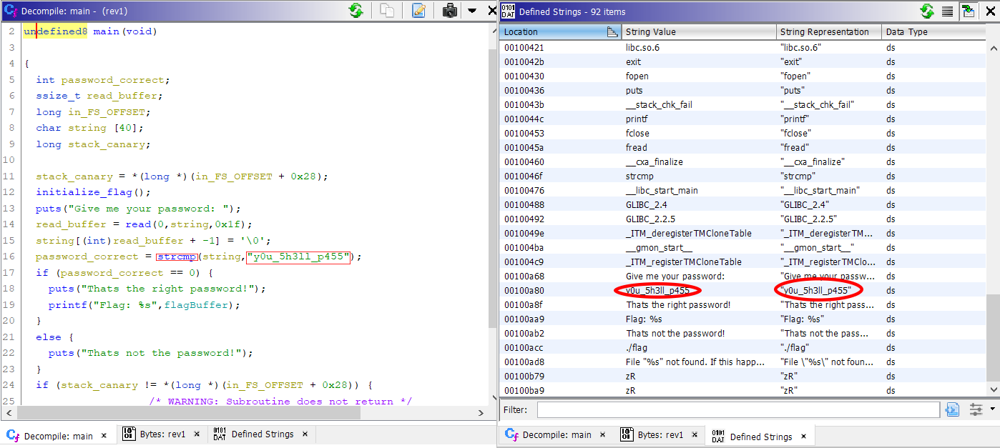

# Intro to Reversing 1

## Information
**Category**: Reverse Engineering    
**Difficulty**: Baby  
**Author:** 0x4d5a  
**Points:** Not known yet  
**Description:**
>This is a introductory challenge for beginners which are eager to learn reverse engineering on linux. The three stages of this challenge will increase in difficulty. But for a gentle introduction, we have you covered: Check out the video of LiveOverflow or follow the authors step by step guide to solve the first part of the challenge.
>
>Once you solved the challenge locally, grab your real flag at: nc hax1.allesctf.net 9600
>
>Note: Create a dummy flag file in the working directory of the rev1 challenge. The real flag will be provided on the server

## Overview

As attachment there is an ZIP file.
In this ZIP file there are two files:
>flag   
>rev1

The rev1 file is an ELF linux excecutable binary:   
```
rev1: ELF 64-bit LSB shared object, x86-64, version 1 (SYSV), dynamically linked, interpreter /lib64/ld-linux-x86-64.so.2, for GNU/Linux 3.2.0, BuildID[sha1]=c26549fbcc84a4199635818d97bd48b69eea5fb2, not stripped
```

## Solution 1 (laziest - strings)

As command I used:   
`strings rev1`

It gives the following output:   
```
/lib64/ld-linux-x86-64.so.2
libc.so.6
exit
fopen
puts
__stack_chk_fail
printf
fclose
fread
__cxa_finalize
strcmp
__libc_start_main
GLIBC_2.4
GLIBC_2.2.5
_ITM_deregisterTMCloneTable
__gmon_start__
_ITM_registerTMCloneTable
AWAVI
AUATL
[]A\A]A^A_
Give me your password:
y0u_5h3ll_p455    <------------- Password
Thats the right password!
Flag: %s
[...]
```
In the marked line is the actual password!   
Submitting the flag: `nc hax1.allesctf.net 9600`   

```
Give me your password:
y0u_5h3ll_p455
Thats the right password!
Flag: CSCG{ez_pz_reversing_squ33zy}
```

## Solution 2 (Ghidra)

I created an Ghidra project with the rev1 file   
Now there are two options, either go into the main function and search for the string compare or look into the found strings.

