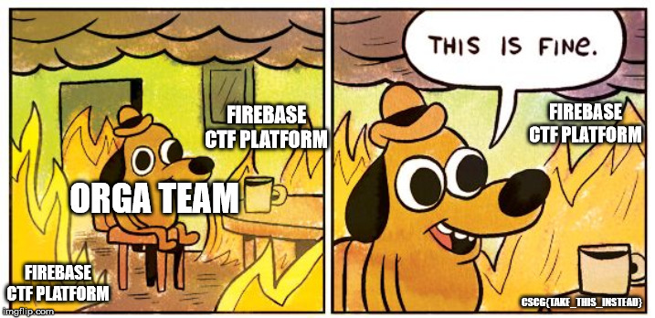

# Sanity Check

## Information
**Category**: Misc    
**Difficulty**: Baby  
**Author:** explo1t  
**Points:** 45  
**Description:**
>We had minor issues launching the ctf platform and used the [discord channel](https://discordapp.com/invite/MH6efZZ) to meme about it.  
>Join the discord and find the hidden flag in the announcement channel.

## Solution
Since I live in Germany according to the motto:  
"Sprich **Deutsch** du  *liebliche Gestalt*"  
Let's not go to the English "#annoucements" channel as instructed,  
but to the German "#ankündigungen" channel. There we find a message from "explo1t":
>Liebe Challenger,  
>@everyone  
>leider verzögert sich der Start der CSCG etwas, wir arbeiten aber mit Hochdruck daran die Plattform zum laufen zu bringen. Bitte habt noch etwas Geduld. (Corona und Augustiner sind schuld).
>
>Wir informieren euch, sobald wir neue Informationen haben.
>
>Euer CSCG-Orga Team
>

The picture looks interesting.  
With a good eye you can see a mysterious text in the lower right corner of the picture.
>CSCG{TAKE_THIS_INSTEAD}

Oh, it looks like a CSCG flag.
And it is :smile: