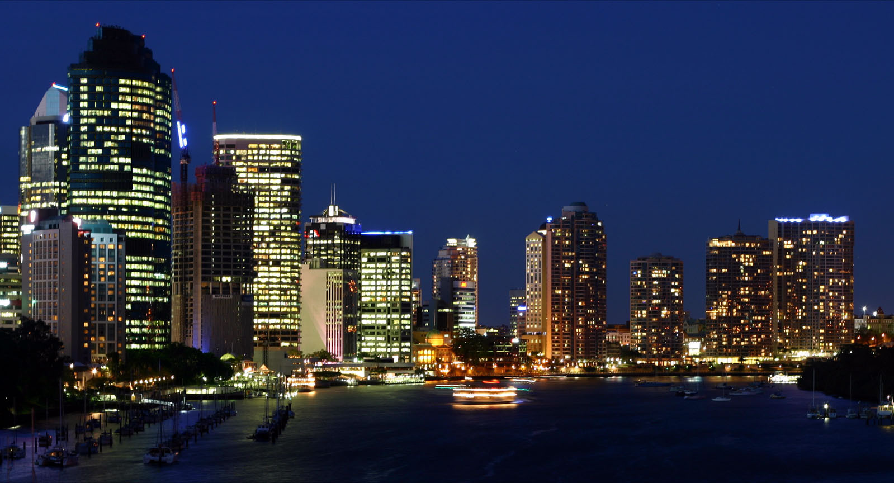
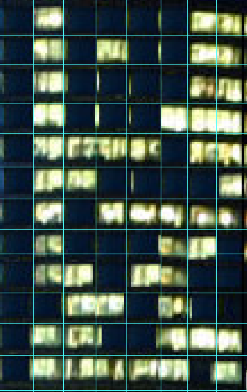

# Intro to Stegano 2

## Information
**Category**: Stegano    
**Difficulty**: Baby  
**Author:** explo1t  
**Points:** Not known yet  
**Description:**
>This is an introductory challenge for the almighty steganography challenges. The three stages contain very different variants of hidden information. Find them!

## Overview

As challenge file there's one picture:
>chall.jpg
The picture is this:   



## Solution

On the big tower on the left, the windows are weird and look edited.
There are now two possibilities:    
- Data is hidden there 
- [The image was scanned by a Xerox copier](https://www.youtube.com/watch?v=7FeqF1-Z1g0)   

I searched for the "original" Picture and found this:  
[WikiMedia Brisbane_City_Night.jpg](https://upload.wikimedia.org/wikipedia/commons/0/05/Brisbane_City_Night.jpg)  
You can clearly see the difference.

I cut the picture out and added line for easier reability:



As result this came out:
```
01000011 01010011 01000011 01000111 01111011 01100001 01011111 01000110 01101100 00110100 01100111 01111101
```
Encoded in ASCII it looks like this:
```
CSCG{a_Fl4g}
```

And it looks like an Fl4g

## Mitigation

Saving data in images, especially if the original is freely available, should not be done. Through the original you can easily see the differences in the data